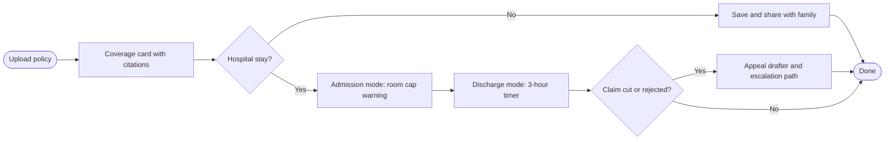
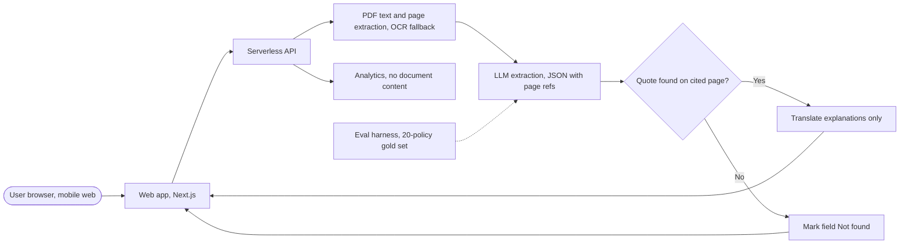

# ClaimReady

**Know your cover before the hospital does.**

ClaimReady is a free web app that helps Indian families understand their health insurance policy *before* a hospital stay, so they can avoid preventable claim deductions, discharge delays, and rejections. Every answer is cited to the exact clause and page of the user's own policy. If ClaimReady can't find something, it says so instead of guessing.

> **Status:** Pre-alpha, in active development (6-week build, Sep 21 to Nov 1, 2026).
> **Type:** Product management portfolio project, built with Google Antigravity.
> **Disclaimer:** ClaimReady gives information, not legal or medical advice.

---

## Table of contents

- [The problem](#the-problem)
- [Who it's for](#who-its-for)
- [What it does](#what-it-does)
- [How it works](#how-it-works)
- [Trust principles](#trust-principles)
- [Tech stack](#tech-stack)
- [Repository structure](#repository-structure)
- [Getting started](#getting-started)
- [Configuration](#configuration)
- [Extraction data contract](#extraction-data-contract)
- [API reference](#api-reference)
- [Evaluation](#evaluation)
- [Privacy and data handling](#privacy-and-data-handling)
- [Cost model](#cost-model)
- [Success metrics](#success-metrics)
- [Roadmap](#roadmap)
- [Product documentation](#product-documentation)
- [Contributing](#contributing)
- [Known limitations](#known-limitations)
- [License](#license)

---

## The problem

Families usually learn what their health policy actually covers at the worst possible moment: the hospital billing desk. By then, the room is chosen, documents are missing, and deductions are locked in.

The numbers (FY 2024-25, from IRDAI's annual report as reported by secondary sources; verify before quoting):

| Signal | Data point |
|---|---|
| Lives covered by health insurance | About 580.6 million |
| Health claims processed | About 3.26 crore |
| Claims repudiated | About 8%, roughly 1 in 12 |
| Value rejected or repudiated | About ₹30,000 crore, up about 15% |
| Insurance ombudsmen for the whole country | 18 |

The most common rejection reasons are predictable: non-disclosure of pre-existing disease, waiting periods not over, exhausted sub-limits (room rent, ICU, disease caps), short admissions, and unlisted day-care procedures. Predictable failures are exactly what software can check for.

Meanwhile, regulation increasingly favors policyholders. IRDAI's May 2024 Master Circular requires insurers to decide cashless requests within 1 hour and authorize discharge within 3 hours, but these rules only help people who know them.

## Who it's for

**Primary user: the caregiver.** An adult child (25 to 40) managing a parent's hospital stay. Mobile-first, stressed, time-poor, often on hospital Wi-Fi, and may prefer Telugu or Hindi for dense text.

**Job to be done:** *"Help me not lose money or get stuck at discharge while I'm exhausted and don't understand insurance."*

**Secondary user: the planner.** Someone with no emergency right now who wants to understand the family's cover in advance.

**Not for v1:** insurance agents, hospital TPA desks, insurers.

## What it does

ClaimReady follows the family's journey with four modes:

| Mode | When | What it does |
|---|---|---|
| **Know Your Policy** | Any time | Upload a policy and get a one-page, plain-language coverage card. Every line is cited to clause and page. |
| **Admission** | At the hospital desk | **Room choice warning:** enter a room's daily price and see whether it exceeds your cap and roughly how much of the claim could be cut. Plus a document checklist. |
| **Discharge** | Waiting at billing | A 3-hour timer based on the IRDAI rule, and a ready-to-send message when the insurer runs late. |
| **Rejection** | After a claim decision | An appeal draft citing your policy's clauses, plus the escalation path: insurer grievance, then Bima Bharosa, then the Ombudsman. |



**Signature feature: the room choice warning.** In many policies, choosing a room above the cap doesn't just cost the difference; the insurer can reduce other bill items (doctor fees, tests) in the same proportion. One panicked decision at admission can cut the whole claim. ClaimReady shows this as a labeled estimate, with its assumption and cited clause, before the family decides.

## How it works



1. **Parse.** Extract text from the policy PDF with page numbers. OCR runs only when a page has no text layer.
2. **Extract.** An LLM returns 10 key fields as structured JSON. Each field includes the value, an exact quote from the policy, and the page and clause it came from.
3. **Validate.** A deterministic check confirms that every quote actually appears on the cited page. Any field that fails is shown as "Not found", never as a guess. **This validator is the trust layer.**
4. **Explain.** Plain-language explanations are generated and optionally translated to Telugu or Hindi. Values and quotes are never translated, so a limit can't change meaning in translation.

### The 10 extracted fields

| Field | Why it matters |
|---|---|
| Sum insured | Overall ceiling |
| Room rent cap | Most common avoidable deduction |
| ICU cap | High-cost stays |
| Co-payment % | Guaranteed out-of-pocket share |
| Initial waiting period | Early-policy rejections |
| Pre-existing disease waiting period | Top rejection reason |
| Specific disease waiting periods | Procedure-level rejections |
| Disease-wise sub-limits | Partial settlements |
| Pre and post hospitalization days | Missed reimbursements |
| Claim intimation deadline | Procedural rejections |

## Trust principles

These are product rules, not aspirations. Each one is enforced in code or in the release process.

1. **Evidence always.** Every policy fact links to its clause and page.
2. **"Not found" beats a guess.** No citation means no answer.
3. **Estimates are labeled.** Any rupee calculation shows the word "Estimate" and its assumption.
4. **Plain language.** No insurance jargon without a one-line explanation.
5. **Independent.** No ads, no policy selling, no commissions.
6. **Minimal data.** ClaimReady doesn't save documents. See [Privacy and data handling](#privacy-and-data-handling) for exactly what the AI provider does.

## Tech stack

| Layer | Choice | Notes |
|---|---|---|
| Frontend | Next.js, Tailwind CSS | Mobile-first, 360px minimum width |
| Backend | Next.js API routes (serverless) | Hosted on Vercel or similar |
| AI model | Google Gemini API (paid tier) | Final model chosen by the Week 2 eval |
| PDF parsing | PDF text library, OCR fallback | OCR only for pages without a text layer |
| Fonts | Noto Sans, Noto Sans Telugu, Noto Sans Devanagari | One family keeps all three scripts consistent |
| Analytics | Privacy-friendly event tracking | No document content, no names |
| Build tool | Google Antigravity | Agent-assisted development from written specs |

## Repository structure

Planned layout; folders are added as each phase ships.

```
claimready/
├── app/                      # Next.js pages and UI
│   ├── page.tsx              # Home and upload
│   ├── card/                 # Know Your Policy coverage card
│   ├── admission/            # Room choice warning and checklist
│   ├── discharge/            # 3-hour timer
│   └── appeal/               # Appeal drafter
├── app/api/                  # Serverless endpoints (see API reference)
├── lib/
│   ├── parse/                # PDF text and page extraction, OCR fallback
│   ├── extract/              # LLM prompts and JSON schema
│   ├── validate/             # Citation validator (quote must exist on page)
│   ├── translate/            # Explanation translation (never values or quotes)
│   └── analytics/            # Privacy-safe event tracking
├── eval/
│   ├── gold-set/             # Hand-labeled answers for 20 public policies
│   ├── policies/             # Public policy wording PDFs (no personal data)
│   ├── run-eval.ts           # Scores extraction against the gold set
│   └── reports/              # Per-field accuracy reports
├── docs/                     # Specs, decision log, research summaries
├── .env.example
└── README.md
```

## Getting started

### Prerequisites

- Node.js (current LTS version)
- A Google Gemini API key on a project **with billing enabled** (see [Privacy](#privacy-and-data-handling) for why)

### Install and run

```bash
git clone https://github.com/<your-username>/claimready.git
cd claimready
npm install
cp .env.example .env.local   # then fill in your values
npm run dev
```

Open `http://localhost:3000` in a browser, ideally with mobile device emulation at 360px width.

### Run the eval

```bash
npm run eval
```

This runs extraction on every policy in `eval/policies/`, compares results against `eval/gold-set/`, and writes a per-field accuracy report to `eval/reports/`.

## Configuration

| Variable | Required | Description |
|---|---|---|
| `GEMINI_API_KEY` | Yes | API key from a **paid-tier** Google project |
| `GEMINI_MODEL` | Yes | Model name selected by the eval |
| `MAX_FILE_MB` | No | Upload size limit, default `20` |
| `MAX_PAGES` | No | Pages processed per policy, default `80`; users are told when pages are skipped |
| `THINKING_BUDGET` | No | Cap on reasoning tokens to control cost |
| `ANALYTICS_KEY` | No | Key for privacy-safe analytics |

Never commit `.env.local`. API keys must never appear in client-side code.

## Extraction data contract

Every field is returned in this shape. Anything missing a valid quote is converted to `"status": "not_found"`.

```json
{
  "field": "room_rent_cap",
  "value": "Rs 5,000 per day",
  "status": "found",
  "quote": "Room rent is payable up to Rs 5,000 per day",
  "page": 12,
  "clause": "4.2",
  "explanation": "Your policy pays up to Rs 5,000 per day for the room. A costlier room can reduce other parts of your claim."
}
```

## API reference

| Endpoint | Input | Output |
|---|---|---|
| `POST /api/extract` | Policy file (PDF or image) | Array of 10 field objects in the data contract shape |
| `POST /api/room-check` | Room price per day and room cap field | Over or under cap, estimated impact, assumption text |
| `POST /api/appeal-draft` | Rejection reason text and extracted fields | Editable appeal draft citing only clauses found in the policy |
| `POST /api/translate` | Explanations and target language (`te` or `hi`) | Translated explanations |
| `POST /api/feedback` | Field name and a "this looks wrong" flag | Acknowledgement (no document is sent) |

## Evaluation

AI quality is measured, not assumed.

- **Gold set:** 20 public policy wordings from different insurers and plan types, hand-labeled across the 10 fields with page numbers.
- **Accuracy target:** 90% or higher per field.
- **Citation target:** 100%. An uncited answer counts as wrong.
- **Hallucination tolerance:** zero invented values.
- **Release gate:** no deploy if any field drops below its last accuracy score, or if the citation rate falls below 100%.
- **Failure categories tracked:** table parsing, clauses spread across pages, ambiguous wording, OCR errors.
- **Feedback loop:** user reports ("This looks wrong") are reviewed within 48 hours and added to the gold set.

The gold set uses only publicly available policy wordings, so evaluation never requires anyone's personal data.

## Privacy and data handling

ClaimReady's privacy promise has to be *accurate*, not just reassuring. Here's exactly what happens to an uploaded policy.

**What ClaimReady does:** processes the document in memory and discards it. No document text, names, or policy numbers are written to ClaimReady's own storage, logs, or analytics.

**What the AI provider does (Gemini API, paid tier):**
- Prompts and responses are **not** used to train Google's models.
- Google may keep them **for a limited period** solely to detect abuse.
- Zero data retention is being requested for the production project. The stronger privacy promise is used only after written approval.

**Hard rules:**
- **Never** send real user documents through the free tier. On the free tier, content may be used to improve Google's products and read by human reviewers. Free-tier keys are for public gold-set documents only.
- **Never** enable Grounding with Google Search on policy calls, since it stores data for 30 days and can't be disabled.
- **Never** log document content.

**Privacy line shown at upload:**

> ClaimReady doesn't save your documents. To read your policy, we send it securely to Google's Gemini AI, which doesn't use it to train its models and may keep it for a limited time only to prevent misuse.

**Privacy by design (being tested):** a policy has two parts, the generic *wording* (terms and limits, published on insurers' websites) and the personal *schedule* (name, address, policy number). If users upload only the wording and type in their sum insured, no personal data reaches the AI at all.

This design aligns with the principles of India's DPDP Act: clear notice, a single stated purpose, a named processor, and minimal data.

*Provider terms change. Re-verify them against Google's current Gemini API terms before launch.*

## Cost model

Estimates from Gemini API pricing as of September 2026, assuming ₹88 per USD. Replace them with measured token counts after the eval.

| | Cost |
|---|---|
| One coverage card | About ₹1 to ₹7, depending on model tier |
| 100 users a month | About ₹150 to ₹1,200 |
| 10,000 users a month | About ₹14,700 to ₹1,20,000 |

**Decision rule:** choose the cheapest model that passes the 90% accuracy and 100% citation gate. Quality first, cost second.

**Main cost levers:** retrieval (send only relevant policy sections), a budget model tier, and capping thinking tokens. Output tokens, including thinking, drive most of the cost. Note that the mid-tier Flash introductory price doubles on January 1, 2027.

## Success metrics

**North star:** the share of users who can correctly state their room rent cap after seeing the coverage card.

| Metric | Target by Nov 1, 2026 |
|---|---|
| Extraction accuracy / citation rate | 90%+ / 100% |
| Visit to upload conversion | 40%+ |
| Comprehension (north star) | 70%+ |
| Families onboarded | 50+ |
| Share rate | 20%+ |
| Uncorrected reported errors after 48 hours | 0 |

## Roadmap

| Week | Dates | Milestone | Gate |
|---|---|---|---|
| W1 | Sep 21 | Discovery: interviews, survey, PRD v1 | Top 3 problems confirmed in users' words |
| W2 | Sep 28 | Gold set and extraction eval | 80%+ accuracy, on the way to 90% |
| W3 | Oct 5 | Know Your Policy card, tested with 10 families | 5 of 10 find it useful |
| W4 | Oct 12 | Admission mode and room choice warning | 5 users explain the warning correctly |
| W5 | Oct 19 | Discharge timer and appeal drafter | Every draft checked against the actual clause |
| W6 | Oct 26 | Launch and case study | All Must stories accepted |

**Later (after Nov 2026):** WhatsApp sharing of the card, multiple policies per family, waiting-period countdowns, group policy support for employees, and B2B pilot exploration.

**Kill criteria**, written before any code:
- If extraction accuracy stays below 80% after two improvement rounds, narrow to fewer fields or insurers.
- If fewer than 5 of the first 10 families find the card useful, return to interviews before building admission mode.
- If comprehension doesn't improve over a no-card baseline, rethink the card format before adding features.

## Product documentation

This repo is part of a PM portfolio project. The full product thinking lives outside the code:

| Document | Contents |
|---|---|
| **Product Document Suite (Notion)** | PRD, MRD, BRD, TRD, roadmap, 23 user stories with Given/When/Then acceptance criteria, go-to-market plan, journey map, cost model, privacy review |
| **Product Workspace (Miro)** | Visual versions of all of the above, plus the 6-week timeline and the research dashboard (interview log, affinity map, survey, eval, and funnel tracking) |
| **Case study** | *Coming after launch* |

*Links will be added here once the documents are shared publicly.*

## Contributing

Contributions, especially bug reports about wrong extractions, are welcome.

1. **Report a wrong answer.** Open an issue with the field name, insurer, and plan name. Never attach a personal policy or anyone's personal details. Link the public policy wording instead.
2. **Add a gold-set policy.** Add a *public* policy wording PDF to `eval/policies/` and its hand-labeled answers to `eval/gold-set/`, with page numbers for every field.
3. **Change prompts or models.** Run `npm run eval` and include the before-and-after accuracy report in your pull request. Changes that lower any field's accuracy or the citation rate won't be merged.

Every pull request must pass the Definition of Done:
- Acceptance criteria pass on Android Chrome and iOS Safari at 360px width.
- Loading, empty, error, and low-confidence states work.
- No document content is stored or logged.
- The eval gate passes if the change touches extraction.

## Known limitations

- Proportionate deduction rules vary between policies, so room-cap impact is always an estimate, never a guarantee.
- Limits hidden in complex tables may be parsed incorrectly; table-heavy policies are tested early.
- Clauses spread across pages need multi-page citations.
- Scanned or low-quality documents may fail OCR; users see a clear error and can retry with a clearer photo.
- Group (corporate) policies with separate benefit tables aren't supported in v1.
- ClaimReady doesn't file claims, compare policies, or give legal or medical advice.

## License

MIT (to be confirmed). See `LICENSE`.

---

*ClaimReady gives information, not legal or medical advice. Always confirm important decisions with your insurer or the hospital's insurance desk.*
